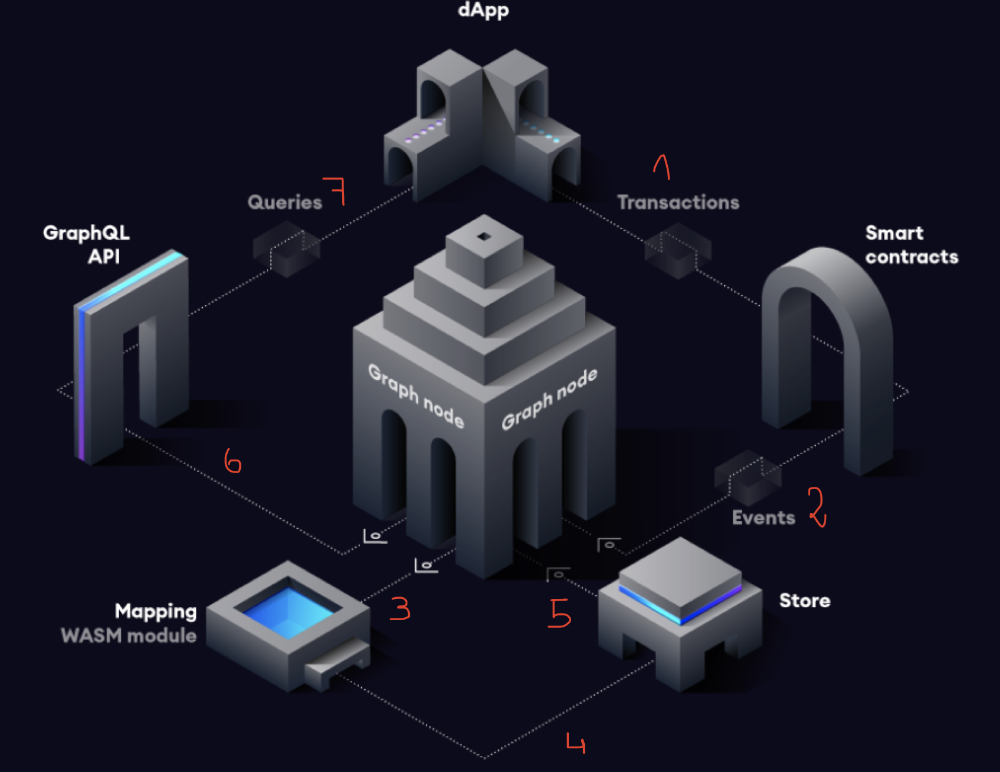

# What is The Graph ?

The Graph is a decentralised **indexing protocol** for querying data on Ethereum and IPFS by using a querying language **GraphQL**.

Anyone can build and publish open APIs, called subgraphs, making data easily accessible (today approx 1000 subgraphs have been created)

A subgraph can consist of other subgraph to provide a more consolidated view of data.

Dapps can use one or multiple subgraph.

The Graph provides an explorer to find the subgraphs of the protocols (ex : uniswap, compound…)

# What is the architecture of the Graph ?

**GRT** is a token from The Graph that is an ERC-20 on the Ethereum blockchain. It is used to allocate resources in the network.

Network participants on the Graph :

- Indexers : Operate a node to index data and serve queries
  - Stake GRT tokens to run a node on the Graph
  - Index relevant subgraphs and fee consumers for using their subgraphs.
  - They can price their services ⇒ this create a market place as indexers compete with each other to provide the highest quality data at the lowest price.
  - There are approx 168 indexers.
  - GRT of indexers can be slashed if they are malicious and serve incorrect data to applications or if they index incorrectly.
- Curators : Organise data by signaling subgraphs that are worth indexing
  - They can be either developer that want to make sure their subgraph is indexed or end users that find a particular subgraph worth indexing.
  - They receive rewards proportionally to the popularity of a subgraph they have signaled.
- Delegators : Secure the network by delegating GRT to Indexers
  - They stake their GRT token to indexers in order to earn a portion of their rewards and fees.
  - They don t have to run a graph node.
- Consumers : Create a subgraph or use existing subgraphs in a dapp
  - They pay indexers for providing them data from different subgraphs.
  - They can be either end users or web services or both.
- Fisher(wo)men and arbitrators : verify the quality of data
  - They solve conflicts in the case of incorrect data provided by an indexer to a consumer.

# What is the flow of data once a subgraph is deployed?

The flow follows these steps:

1. The dApp creates/modifies data on Ethereum through a transaction to a smart contract.
2. The smart contract emits one or more events (logs) while processing the transaction.
3. Graph Node continually scans the chain for new blocks and the data for your subgraph they may contain. It listens to specific events and triggers handlers in a user-defined mapping.
4. Graph Node runs the mapping handlers. The mapping is a WASM module that creates or updates the data entities that Graph Node stores in response to events.
5. The store is updated along with the indexes.
6. The dApp queries the Graph Node for data indexed from the blockchain using the node's [GraphQL endpoint](https://graphql.org/learn/). The Graph Node translates the GraphQL queries and fetch the data in the store, using the store's indexing capabilities.
7. The dApp displays the data in a user-friendly format.

# How we can set up a subgraph that will provide information on the ERC725Y events ?

Each subgraph is storing pieces of information from events sent by a Smart Contract on chain.

We want to index information from a ERC725 base account. Each UP is a smart contract that emits events such as : update name, change picture …

We will need to create a subgraph for each universal profile.

Is that relevant ?

# Do we need to code something?

There are two ways to deploy a subgraph :

1. Local development ([https://thegraph.academy/developers/local-development/](https://thegraph.academy/developers/local-development/))

2. Hosted Service through the Graph Explorer ([https://thegraph.academy/developers/hosted-service/](https://thegraph.academy/developers/hosted-service/))
   Subgraphs are created from a local graph node and published in the Graph Explorer through a GitHub account authentification. Graph Node supports a number of Ethereum testnets (Rinkeby, Ropsten, Kovan…) in addition to mainnet.
   For now graph node created through a hosted service doesn't support LUKSO L16 network.

3. The Subgraph Studio ([https://docs.thegraph.academy/official-docs/subgraph-studio/deploy-a-subgraph-to-the-subgraph-studio](https://docs.thegraph.academy/official-docs/subgraph-studio/deploy-a-subgraph-to-the-subgraph-studio))
   The Subgraph Studio is a place to build and create subgraphs without the need to run a graph node. Subgraph are published to the graph studio through a metamask authentification.

# Do we have to spin up machines?

If we use Hosted Service (option2 above), we have to spin up a graph node.
If we use Graph Studio (option3 above), machines are spinned up by indexors (nodes operators of The Graph) and we don't have to spin up machines.

# What is the structure of a subgraph ?

- Subgraph Manifest

  Yaml file

  - Schema
    a graphQL schema
  - Datasources

    network : what network you want to extract data from

    address : what contract you want to extract data from

    eventHandlers : events that are emitted by smart contracts. Triggered after a function updates the smart contract storage.

    callHandlers : a callHandler is executed when a specific function is called on a smart contract. Each function has a specific function signature that can be detected by the graph node. Only work on open Ethereum nodes.

    blockHandler : executed whenever a block is ingested by the graph node. Not used often because it is expensive to trigger every time a block is emitted.

- GraphQL Schema
  GraphQL file
  Schema that defines the structure of entities. **Entities** are object containing data.
  All queries will be made against the data model defined in the subgraph schema and the entities indexed by the subgraph.
- Mapping
  Typescript file (compiled into assembly script (WASM)).
  Connects what is on the blockchain and your subgraph.
  Specifies what code is going to run when a specific event is emitted on chain.

# Conclusion

- Is it relevant to create a subgraph for each UP ?
  If yes, we would be curators and finance indexers to index each UP.
- For now it is not possible to create a subgraph based on a UP because L16 test net is not available.

# Glossary

**Indexing** : way of organising data to cut the search time.

**GRT** : tokens of The Graph

**WASM Module (WebAssembly Module)** : object that contains stateless WebAssembly code which has already been compiled by the browser.

**Entities :** object containing data. Defined in the graphQL schema. Building blocks of a subgraph.

# Resources

[https://thegraph.com/docs/en/developing/creating-a-subgraph/](https://thegraph.com/docs/en/developing/creating-a-subgraph/)

[https://thegraph.com/docs/en/network/indexing/](https://thegraph.com/docs/en/network/indexing/)

[watch?v=l2rzT_Dp4T0](https://www.youtube.com/watch?v=l2rzT_Dp4T0)

[watch?v=7gC7xJ_98r8](https://www.youtube.com/watch?v=7gC7xJ_98r8)

[watch?v=ANDeiXFiYC4](https://www.youtube.com/watch?v=ANDeiXFiYC4)

[watch?v=ANDeiXFiYC4](https://www.youtube.com/watch?v=ANDeiXFiYC4)

[https://www.youtube.com/watch?v=i8Jl8XvAz54](https://www.youtube.com/watch?v=i8Jl8XvAz54)

[https://www.youtube.com/watch?v=HfDgC2oNnwo](https://www.youtube.com/watch?v=HfDgC2oNnwo)

[https://www.youtube.com/watch?v=i8Jl8XvAz54](https://www.youtube.com/watch?v=i8Jl8XvAz54)
